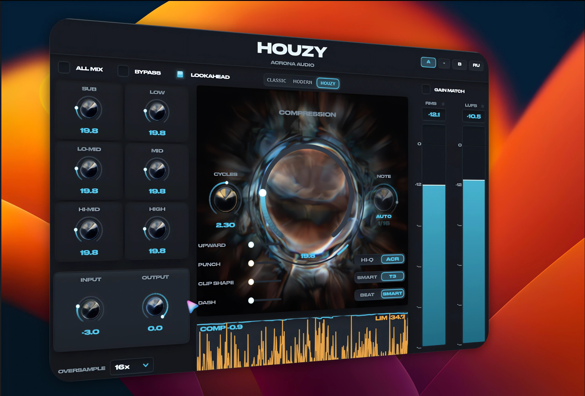
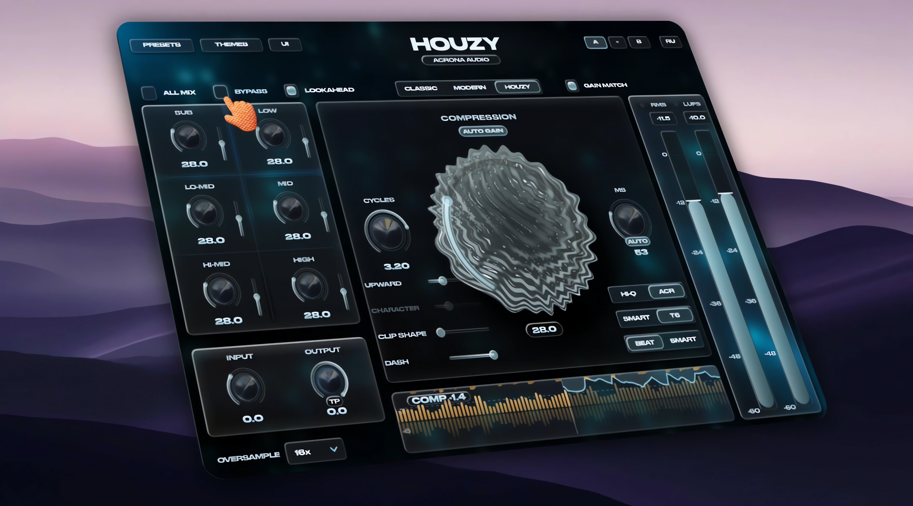

<div align="center">

**English** · [Русский](README.ru.md)

# HOUZY

<sup>**v4.8.0** · 27 September 2026</sup>

**A next-generation mastering compressor**

Three original technologies: **HOUZY** — loud sounds don't drag the rest down, and the compression stays equally steady in loud and quiet parts,
**ACR** — a clipper that stops chopping the highs,
**CYCLES / NOTE** — attack in wave cycles and release in beat fractions or milliseconds.

[]()
[]()
[]()
[]()

<br>

### [⬇ Windows · VST3](https://raw.githubusercontent.com/IACRONA/HOUZY/main/Releases/HOUZY-VST3-Windows.zip) · [⬇ Windows · installer](https://raw.githubusercontent.com/IACRONA/HOUZY/main/Releases/HOUZY-Windows-Installer.zip) · [⬇ macOS](https://raw.githubusercontent.com/IACRONA/HOUZY/main/Releases/HOUZY-Installer.pkg)

**Windows · VST3** — unzip and drop the `HOUZY.vst3` folder into `C:\Program Files\Common Files\VST3\`, then rescan plugins in your DAW.

**Windows · installer** — does the same thing for you.

**macOS** — the installer puts VST3 and AU where they belong. Or the bundles on their own: [VST3](https://raw.githubusercontent.com/IACRONA/HOUZY/main/Releases/HOUZY-macOS-VST3.zip) · [AU](https://raw.githubusercontent.com/IACRONA/HOUZY/main/Releases/HOUZY-macOS-AU.zip) — **AU** is the one Logic and GarageBand use.

> **macOS is currently on 4.7.0** — two releases behind. Everything in it works; it just
> doesn't have the changes from 4.7.1 and 4.8.0 yet. The Mac build is made on an
> actual Mac, so it follows a little later.

> **A note on the installer.** It isn't code-signed yet, so Windows may show
> "Windows protected your PC" — click **More info → Run anyway**. Some scanners flag
> unsigned Inno Setup files by machine-learning guess, not because of anything inside.
> The plain zip above sidesteps this entirely: it holds the plugin folder and nothing
> executable. Code signing is planned for the commercial release.

**Works on:** Windows 10 / 11 (64-bit) · macOS, Apple Silicon and Intel.

<br>



<sub>HOUZY 4.8 — free, available above</sub>

<br><br>

## ✦ Coming soon — HOUZY 5

**This is what version 5 looks like.**
A completely new design in the **Liquid Glass** style — the direction modern
interfaces are moving in: translucent glass panels with the background showing
through, soft light along every edge, knob tips that stretch like a drop of liquid,
and a living liquid sphere in the centre that breathes with your music.

**HOUZY 5 will be a paid release.**
**Version 4.8 stays free** — it remains available right here and will keep getting
updates.

<br>



<sub>HOUZY 5 — Liquid Glass design · coming soon</sub>

</div>

<details>
<summary><b>What else is coming in HOUZY 5</b></summary>

- **Make it yours** — five backgrounds under **THEMES**, four colours of the liquid sphere
  under **UI**, or UI OFF to keep the centre still
- **Meters you can trust** — RMS and LUFS exactly to the broadcast standard
  (ITU-R BS.1770-4), correct readings on mono tracks, and far more accurate A/B level
  matching
- **More stable** — no more crash when closing the plugin window, protection against
  broken or extremely loud samples at the input, safe handling of unusual buffers
- **PUNCH from 0 to 100**, where 0 means "follow DASH"; old projects convert
  automatically and sound the same
- **Shorter, clearer tooltips**, also shown when hovering a knob's name
- **Smoother panel** while a track is playing

</details>

---

## The problem

An ordinary compressor is `output = gain × signal`. **One number for the whole sound.**

Every classic complaint follows from that:

- **the detector is blind** — the entire spectrum is collapsed into one number, so a
  kick and a vocal of the same amplitude are indistinguishable to it;
- **the kick drags everything with it** — it is the loudest thing, the gain drops,
  and the hats, the vocal and the reverb tails dive with it. That is pumping;
- **attack fights punch** — one envelope has to serve both the transient and the body;
- **the bass gets dirty** — multiplication is modulation: the gain moves, and sidebands
  grow around a 50 Hz kick. The compressor ruins the very thing it was evening out.

Multiband does not fix this. It gives you a few numbers instead of one, but each is
still a single number for an entire band.

---

## HOUZY — even compression across every frequency in the track

The sound is taken apart into **individual tones**, and each one's loudness is evened
out by its own envelope. **Loud sounds don't drag the rest down, and the compressor
compresses sounds equally steadily, regardless of how loud any frequency in the mix
is.** Say the track has a loud kick, low end or midrange — the compressor will squeeze
the lows and the highs just the same.

Worth knowing: **there is no threshold here.** The compressor analyses every part of the
track separately and compresses every tone — kick, drums or vocal — the same way,
regardless of its loudness. Then the level is raised back automatically (make-up gain),
which gives you a well and densely compressed track. The compressor can be used not
only on the master, but the CPU load will grow.

**What that buys you:**

| | |
|---|---|
| **No frequency drags the others down** | The kick and the hat are different tones with different envelopes. The kick can be squeezed as hard as you like and the top end never notices. |
| **The detector can finally see** | Every tone arrives with its own frequency, so loudness is judged with a hearing weighting — the same curve used by LUFS meters. |
| **Punch survives per tone** | A tone that has only just appeared is not compressed. The body of the kick can be crushed while its leading edge stays untouched. |
| **The bass cannot be modulated** | Attack is measured in **wave cycles**, not milliseconds, and can never physically become faster than half a cycle. |

HOUZY is the default engine. Two classic engines are still on the switch:
**CLASSIC** (denser, one line, a little louder) and **MODERN** (softer and more
dynamic, cleaner low end). The plugin's delay is the same in all three, so switching
never makes your DAW re-sync the track.

---

## CYCLES and NOTE / MS — attack and release, reinvented

The millisecond is a poor unit for attack, and not always the right one for release.
That follows from arithmetic, not taste.

### Attack in wave cycles, not milliseconds

**5 ms on a 50 Hz bass note is a quarter of its wave.** The gain moves inside a single
oscillation: that is no longer dynamics, it is modulation — and it is exactly where a
compressor dirties the low end.

**The same 5 ms on an 8 kHz hat is forty cycles.** An eternity.

One number physically cannot serve both. But in HOUZY every tone arrives **with its own
frequency**, so "one cycle" is a quantity we actually have. Attack is set in cycles and
turns itself into the right number of milliseconds at every frequency.

> One knob, one position: **45 ms at 50 Hz and 1 ms at 8 kHz.**
> The attack is **never faster than half a cycle** of the tone — the bass cannot be
> modulated at all, and that is guaranteed by the design rather than by careful setting.

The knob is labelled **CYCLES**.

### Release in beat fractions — or in milliseconds

A release dialled in at 128 BPM is wrong at 124: the beat has moved, the milliseconds
have not. So the release has **two units**, switched by **clicking the label** above
the knob:

- **NOTE** — a fraction of a bar. **HOUZY takes the tempo from your project settings**
  (the host reports the number you set rather than guessing it from the audio), so the
  release stays on the beat when the tempo changes. Any tempo works;
- **MS** — plain milliseconds, 20…1200, continuously. **This is the default.**

### AUTO — the plugin sets the time itself

On by default. The plugin measures how long the material actually rings and uses that
time. That is a measurement, not a guess — how long a sound rings is a fact about the
audio, unlike the shape of an attack, which is a matter of taste. That is why ATTACK
deliberately has no such button.

In **MS** it is more precise: the measured time is used as is, while in NOTE it has to
be rounded to the nearest beat fraction. While AUTO is on, the knob shows the time it
picked.

### BEAT | SMART

A switch sits under the release knob:

- **BEAT** — exactly the release you asked for;
- **SMART** — that release as a **maximum**: a tone that has already died away is let
  go early instead of holding an empty pause. You hear it on a skipped kick and on
  syncopation. **Default.**

---

## ACR — a clipper that stops chopping the highs

An ordinary clipper **slices** the top off the waveform. A slice is an abrupt event, and
its error is broadband. So every kick hit subtracts that error from everything riding on
top of it: the hats, the vocal, the reverb tails.

Hence the classic problem with clipped house: **the harder you drive the kick, the
duller and grittier the top end gets.**

**Oversampling does not fix this.** 16x makes the error clean, but it does not change
*where* the error sits in the spectrum.

**Instead of slicing, ACR subtracts a short pulse** placed exactly at the peak. The
pulse's spectrum is shaped so the distortion lands in the top of the spectrum, where
the hats and the attack of the kick mask it.

The technique is borrowed from mobile network transmitters, where it is applied to LTE
signals, and the pulse kernel is designed from a psychoacoustic model of hearing.

ACR is the default. **HI-Q** — a conventional oversampled clipper — is the other
position of the switch.

---

## What else is in there

- **AUTO GAIN** (on by default) — measures how much the compression took and gives back
  exactly that, so the output stays as loud as the input. Switch it off and nothing is
  added back: you set the level with INPUT
- **Spectral limiter** — SMART (3 bands) or T6 (6 bands), so a peak in the bass does
  not duck the highs
- **GAIN MATCH** — matches the output to the input level so **BYPASS compares character
  rather than loudness**. Without it the plugin is always louder, and "better" just
  means "louder"
- **DASH** — one knob takes the compressor from punchy to even. **PUNCH** shares its row
  (click the label to swap): how much of each hit is left untouched
- **UPWARD** — upward compression: lifts the quiet parts — reverb tails, air, detail
- **CLIP SHAPE** — in HOUZY, a light saturation across the whole spectrum with automatic
  level compensation; in CLASSIC / MODERN, how soft the clipper cuts
- **CHARACTER** — softer to the left, denser to the right
- **ALL MIX** — 6 bands (SUB · LOW · LO-MID · MID · HI-MID · HIGH) with their own
  compression knobs and their own level (−6…+6 dB) feeding each band
- **TP** — true peak on the OUTPUT knob, for the final export to streaming and MP3
- **PRESETS** — SNOOZE, SMOOTH, SMOOTHIE, SUSHI, SQUISHY, from gentle to dense. The list
  stays open so you can click through and compare by ear. Presets move only the
  compression knobs; your engine, clipper and limiter stay as you set them
- **A / B** — two settings slots, compared at matched loudness
- **Oversampling 4x…64x** (16x by default), **LOOKAHEAD** for the limiter
- **Meters** — RMS and LUFS, a gain-reduction graph per stage and a live waveform
- **English and Russian** interface, language follows the system on first run
- **Update check** — a small UPDATE badge lights up when a new version is out; it can be
  switched off in the ACRONA AUDIO card

> HOUZY looks ahead, so it delays the sound by about 80 ms (at 48 kHz). Your DAW
> compensates this automatically, and the delay never changes while you play.

---

## Installing

**Windows** — run `HOUZY-Setup.exe` from the installer zip.
The plugin lands in `C:\Program Files\Common Files\VST3`.

**macOS** — download `HOUZY-Installer.pkg`, double-click it, and tick the formats
you want. The installer puts them where they belong.

> **The system will block the package on first launch** — it is not signed with an Apple
> certificate yet, and macOS quarantines anything unsigned. Get past it with
> **right-click the file → Open → Open** again in the warning. Or: System Settings →
> Privacy & Security → "Open Anyway" at the bottom.
>
> Nothing is broken and nothing is infected — macOS treats every unsigned installer
> this way.

Both Mac formats are Universal — Apple Silicon and Intel alike.
**AU** is the one Logic and GarageBand use, **VST3** is for everything else.

<details>
<summary>Install by hand, without the installer</summary>

Download the zip for the format your DAW uses, unpack it, and drag the bundle into the
matching folder:

| format | put it in | used by |
|---|---|---|
| `HOUZY.vst3` | `/Library/Audio/Plug-Ins/VST3/` | Ableton, Reaper, Cubase, Bitwig, FL |
| `HOUZY.component` | `/Library/Audio/Plug-Ins/Components/` | Logic Pro, GarageBand |

Installing by hand leaves the quarantine flag on, so clear it in Terminal — only the
line for the format you actually installed:

```bash
xattr -dr com.apple.quarantine /Library/Audio/Plug-Ins/VST3/HOUZY.vst3
xattr -dr com.apple.quarantine /Library/Audio/Plug-Ins/Components/HOUZY.component
```

Then restart your DAW and rescan.

</details>

**Close your DAW before installing or updating** — a running DAW keeps the plugin file
locked.

---

## What's new

## v4.8.0 · 27 September 2026

- **AUTO GAIN now really gives back what HOUZY takes.** In HOUZY mode it saw no loss
  and returned almost nothing. **HOUZY can therefore play louder in projects you
  already have** — up to about 2 dB at the default setting on an open mix. If you
  liked it where it was, pull OUTPUT down to match
- **New TP button on the OUTPUT knob — true peak** for the final export
- **No more clicks and gaps when switching modes,** and turning COMPRESSION while
  playing no longer jumps
- **No more crunch or kick clicks on a hot track** — the clipper now takes only the
  short peaks at the very top and the limiter takes the bass and the body of the kick
- **The low end is back at CLIP SHAPE 0,** crash fix for hosts sending bigger chunks
  than announced, and nearly half the CPU of 4.7.1

## v4.7.1 · 24 September 2026

- **HOUZY now plays exactly in time with the rest of your project.** It was telling
  your DAW that it delayed the sound by 25 ms more than it really did, so the DAW
  played it that much early. On a single track, a drum bus or in parallel processing
  that smeared every hit into a doubled attack. The sound itself has not changed

## v4.7.0 · 16 September 2026

- **Every band now has its own level control.** In ALL MIX mode a thin strip beside
  each compression knob raises or lowers that range *before* the compressor gets to it —
  a band too quiet to be compressed can be brought up, one that tramples its neighbours
  pulled back
- **T7 has been taken off the panel.** It was an unfinished experiment. SMART and T6 are
  unchanged, and anything you already set up sounds exactly the same

---

<div align="center">

**ACRONA AUDIO**

</div>
