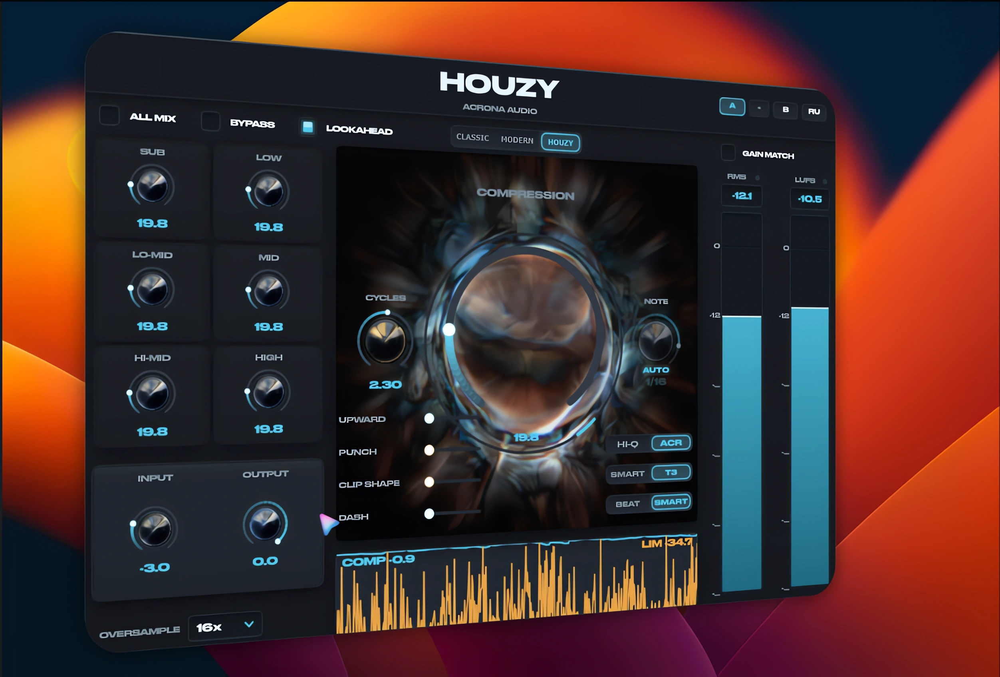

<div align="center">

**Русский** · [English](README.md)

# HOUZY

<sup>**v4.5.1** · 1 сентября 2026</sup>

### Компрессор для мастера - нового поколения

Три собственные разработки:
**HOUZY** — компрессия без общего гейна · **ACR** — клиппер, который не подрубает верх · **CYCLES / BEATS** — атака в периодах волны, релиз в долях такта

[]()
[]()
[]()
[]()

<br>

### [⬇ Windows](https://github.com/IACRONA/HOUZY/raw/main/Releases/HOUZY-Windows-Installer.zip) · [⬇ macOS установщик](https://github.com/IACRONA/HOUZY/raw/main/Releases/HOUZY-Installer.pkg)

Windows: архив · 13 МБ — распакуй и запусти установщик внутри. Или возьми [сам плагин](https://github.com/IACRONA/HOUZY/raw/main/Releases/HOUZY-VST3-Windows.zip) и скопируй в папку VST3 руками
macOS: установщик · 42 МБ — сам поставит VST3 и AU. Или бандлы отдельно: [VST3](https://github.com/IACRONA/HOUZY/raw/main/Releases/HOUZY-macOS-VST3.zip) · [AU](https://github.com/IACRONA/HOUZY/raw/main/Releases/HOUZY-macOS-AU.zip) — **AU** нужен для Logic и GarageBand

> **Версия для macOS сейчас 4.4.2** — на несколько выпусков позади. Она работает как и
> работала, в ней просто пока нет нового AUTO GAIN. Сборка под Mac будет позже.

> **Windows может предупредить при запуске установщика** («Система Windows защитила
> ваш компьютер» — нажми *Подробнее* > *Выполнить в любом случае*). Установщик пока
> без цифровой подписи, а Windows помечает так любой неподписанный установщик от
> небольшого разработчика, что бы внутри ни было. Сертификат планируется к
> коммерческому релизу; пока архив выше снимает блокировку при скачивании, а сам
> файл можно проверить на [VirusTotal](https://www.virustotal.com).

<br>



</div>

---

## Зачем он нужен

Обычный компрессор — это `выход = гейн × сигнал`. **Одно число на весь звук.**

Отсюда все классические беды разом:

- **детектор слепой** — весь спектр свёрнут в одно число, поэтому кик и вокал
  одинаковой амплитуды для него неразличимы;
- **кик тянет за собой всё** — он громче всех, гейн падает, вместе с ним ныряют
  хэты, вокал и хвосты ревера. Это и есть «накачка»;
- **атака спорит с панчем** — одна огибающая обслуживает и удар, и тело звука;
- **бас пачкается** — умножение это модуляция: гейн движется, вокруг кика 50 Гц
  вырастают боковые полосы. Компрессор портит именно то, что выравнивал.

Мультибэнд не лечит: он даёт четыре числа вместо одного, но каждое всё равно
одно на всю полосу.

---

## HOUZY — компрессия без общего гейна

Звук разбирается на **отдельные тона**, и громкость каждого выравнивается своей
огибающей. **Общего гейна нет — значит качать нечему.**

Пампинг здесь не лечится. Он невозможен.

**Что это даёт:**

| | |
|---|---|
| **Ни одна частота не тянет за собой остальные** | Кик и хэт — разные тона с разными огибающими. Кик может давить сколько угодно, верх этого не заметит. |
| **Детектор прозрел** | Каждый тон приходит со своей частотой, поэтому громкость считается с весом по слуху — той же кривой, что в LUFS-метре. |
| **Панч сохраняется у каждого тона отдельно** | Только что появившийся тон не жмётся. Тело кика можно давить сколько угодно, пока его фронт остаётся нетронутым. |
| **Бас нельзя промодулировать** | Атака считается в **периодах волны тона**, а не в миллисекундах, и физически не может стать быстрее полуволны. |

---

## CYCLES и BEATS — переизобретённые атака и релиз

Миллисекунда — плохая единица и для атаки, и для релиза. Это видно из арифметики,
а не из вкусовщины.

### ATTACK в периодах волны, а не в миллисекундах

**5 мс на басу 50 Гц — это четверть его волны.** Гейн успевает дёрнуться внутри
одного колебания: это уже не динамика, это модуляция, и ровно здесь компрессор
пачкает низ.

**Те же 5 мс на хэте 8 кГц — сорок периодов.** Вечность.

Одно число физически не может обслужить оба случая. Но в HOUZY каждый тон
приходит **со своей частотой**, значит «один период» — это величина, которая у
нас есть. Атака задаётся в периодах, и дальше сама превращается в нужные
миллисекунды на каждой частоте.

> Одна ручка в одном положении даёт **45 мс на 50 Гц и 1 мс на 8 кГц**.
> Атака при этом **никогда не быстрее полуволны тона** — бас промодулировать
> нельзя в принципе, это гарантируется устройством, а не настройкой.

Подпись на ручке меняется на **CYCLES**.

### RELEASE в долях такта, а не в миллисекундах

Релиз, подобранный под 128 BPM, на 124 BPM уже не туда: доля такта сдвинулась,
а миллисекунды остались прежними. Компрессор перестал попадать в ритм, и это
слышно как несобранность.

**HOUZY берёт темп из настроек проекта** — хост отдаёт выставленное число, а не
угадывает его по звуку. Релиз задаётся долей такта и не плывёт при смене BPM.

> Работает на **любом темпе** — и на 60, и на 190. Доля такта остаётся долей
> такта, а в миллисекунды её переводит сам плагин.

### NOTE или MS — переключается кликом по подписи

Сетка нот не всегда попадает туда, куда нужно, поэтому у релиза **две единицы**:

- **NOTE** — доля такта, привязана к темпу проекта;
- **MS** — обычные миллисекунды, 20…1200, непрерывно.

Клик по подписи над ручкой меняет одну на другую. **Дефолт — MS.**

Движок и так всегда работал в миллисекундах: ноты были лишь способом их выбрать.
Причём зажим 20…1200 мс съедал верх списка — на 128 BPM две верхние ноты (1/1 и
1/2.) обе упирались в 1200 и делали одно и то же, а на 90 BPM таких было три.

### BEAT | SMART

Под ручкой релиза стоит переключатель:

- **BEAT** — строго заданная доля такта;
- **SMART** — доля как **максимум**: тон, который уже стих, отпускается раньше и
  не держит пустоту. Слышно на пропущенном кике и на синкопах.

### AUTO — плагин ставит время сам

Измеряет, сколько реально звенит материал, и ставит это время. Измерение, а не
догадка: длительность звучания есть факт о звуке, в отличие от формы атаки,
которая дело вкуса — поэтому у ATTACK такой кнопки намеренно нет.

**В режиме MS он точнее.** В нотах измеренное приходится округлять до ближайшей
доли такта, в миллисекундах — не приходится.

Пока AUTO включён, ручка заблокирована и **показывает то, что он выбрал** — цифра
живая, видно, что механизм работает. Выключил AUTO — ручка снова твоя.

---

## ACR — клиппер, который не подрубает верх

Обычный клиппер **срезает** верхушку волны. Срез — резкое событие, его ошибка
широкополосная. Значит каждый удар кика вычитает эту ошибку из всего, что едет
поверх: из хэтов, вокала, хвостов ревера.

Отсюда классическая беда клипнутого хауса: **чем сильнее гонишь кик, тем тусклее
и «песочнее» верх.**

**Оверсэмплинг это не лечит.** 16x делает ошибку чистой, но не меняет, *где* она
лежит в спектре.

**ACR вместо среза вычитает короткий импульс**, поставленный точно в момент пика.
Спектр импульса подобран так, чтобы искажение легло туда, где его маскирует сам
кик. Пик снимается так же ровно, но верх остаётся целым.

Приём заимствован из передатчиков сотовой связи, где его применяют к сигналу
LTE, а ядро импульса спроектировано по психоакустической модели слуха.

> **Громкость ACR и обычного клиппера совпадает** — сравнивать можно напрямую,
> без подгонки уровня. Это не случайность: при равных весах импульс вырождается
> ровно в обычный клип, что проверено численно.

---

## Что ещё внутри

- **GAIN MATCH** — выход подгоняется под громкость входа, чтобы **BYPASS сравнивал
  характер, а не громкость**. Без этого плагин всегда громче, и «лучше» означает просто
  «громче»
- **DASH** — одна ручка ведёт компрессор от «панчево» к «ровно»
- **Спектральный лимитер** — 6 полос, пик в басу не глушит верха
- **Апворд-компрессия** — поднимает тихие участки: хвосты ревера, воздух, детали
- **ALL MIX** — 6 полос с отдельными ручками, когда нужен контроль по диапазонам
- **A / B** — две ячейки настроек со сравнением на выровненной громкости
- **Оверсэмплинг до 64x**, честные метры RMS / LUFS, график сжатия по ступеням
- **Русский и английский** интерфейс, язык определяется по системе

---

## Установка

**Windows** — скачай `HOUZY-Setup.exe`, запусти, готово.
Плагин встанет в `C:\Program Files\Common Files\VST3`.

**macOS** — скачай `HOUZY-Installer.pkg`, двойной клик, отметь галочками
нужные форматы. Установщик сам положит их куда надо.

> **Система заблокирует пакет при первом запуске** — он не подписан сертификатом
> Apple, а неподписанное macOS отправляет в карантин. Обходится так:
> **правый клик по файлу → «Открыть» → «Открыть»** ещё раз в предупреждении.
> Либо: Системные настройки → Конфиденциальность и безопасность → внизу
> «Всё равно открыть».
>
> Это не поломка и не вирус — так система ведёт себя с любым неподписанным
> установщиком.

Оба формата Universal — работают и на Apple Silicon, и на Intel.
**AU** нужен для Logic и GarageBand, **VST3** — для всего остального.

<details>
<summary>Поставить вручную, без установщика</summary>

Скачай архив под свой формат, распакуй и перетащи бандл в нужную папку:

| формат | куда класть | для чего |
|---|---|---|
| `HOUZY.vst3` | `/Library/Audio/Plug-Ins/VST3/` | Ableton, Reaper, Cubase, Bitwig, FL |
| `HOUZY.component` | `/Library/Audio/Plug-Ins/Components/` | Logic Pro, GarageBand |

Карантин при ручной установке снимается командой в Терминале — только для того
формата, который поставил:

```bash
xattr -dr com.apple.quarantine /Library/Audio/Plug-Ins/VST3/HOUZY.vst3
xattr -dr com.apple.quarantine /Library/Audio/Plug-Ins/Components/HOUZY.component
```

Потом перезапусти DAW и пересканируй плагины.

</details>
Собирается из исходников: CMake ≥ 3.22 и C++17, JUCE подтянется сам.

```bash
cmake -B build -DCMAKE_BUILD_TYPE=Release
cmake --build build --config Release
```

---

## Что нового

## v4.5.1 · 1 сентября 2026

- **Громкость больше не сбивается после перемотки.** При переходе на другой участок
  трека первые доли секунды могли звучать не на том уровне: компенсация громкости
  ещё считала по тому куску, который ты только что покинул

## v4.5.0 · 1 сентября 2026

- **AUTO GAIN возвращает столько, сколько нужно.** Раньше плагин прикидывал потерю
  громкости по положению ручки — и ошибался: на реальном материале возвращал около
  15 дБ там, где сжатие забрало примерно один. Теперь потеря измеряется, и обратно
  приходит ровно то, что ушло
- **И его можно отключить.** Под COMPRESSION появилась кнопка AUTO GAIN. Выключаешь —
  громкость не добавляется вообще, звук только сжимается, а уровень ты ставишь сам
  ручкой INPUT. Удобно, когда надо услышать работу компрессора, а не то, что стало
  громче
- **Ручка INPUT снова работает.** Она перестала двигать выход: компенсация громкости
  молча отменяла всё, что ты прибавлял

## v4.4.3 · 20 августа 2026

- **На графике теперь виден сам звук.** Справа сигнал заходит таким, каким пришёл,
  слева выходит обработанным — разница между половинами и есть работа плагина,
  её видно прямо на картинке
- **Выход рисуется ровно таким, каким уйдёт в трек.** Раньше он снимался на ступень
  раньше, и самые громкие места выглядели на экране выше, чем получались в рендере
- **Убрана тряска.** График дёргался, потому что картинка обновлялась в одном ритме,
  а данные приходили в другом. Теперь у него свой ход, и он едет ровно
- **Шкала сжатия стала точнее, и у неё появились подписи.** Привычные полдецибела и
  децибел теперь видно, раньше они тонули; глубину можно прочитать, а не угадывать
  по форме
- **Две цифры ушли из угла.** Они повторяли то, что и так нарисовано, а стоя рядом
  считались по-разному — и сбивали с толку вместо того, чтобы помогать


---

<div align="center">

**ACRONA AUDIO**

</div>

